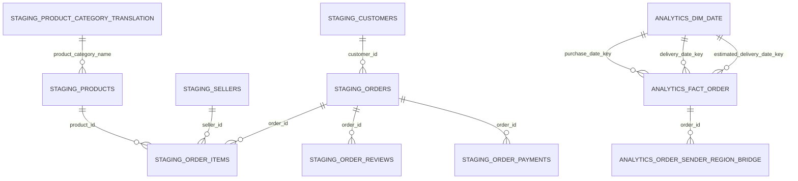

# Olist Postal BI — PostgreSQL + Apache Superset

Project luyện SQL/BI theo góc nhìn nghiệp vụ bưu chính: phân tích **sản lượng đại diện bởi đơn hàng Olist** và hiệu quả giao hàng. Olist là dữ liệu thương mại điện tử Brazil, không phải dữ liệu Vietnam Post. `freight_value` là phí vận chuyển trong bộ dữ liệu Olist, **không phải doanh thu VNPost**. Ngày giao dự kiến chỉ là mốc tham chiếu để đo đúng hạn.

Xem bản báo cáo tóm tắt tại [`docs/project_report.md`](docs/project_report.md).

Báo cáo đã bổ sung **phân tích và đánh giá theo 5 bước**: xác định vấn đề, thu thập dữ liệu, làm sạch dữ liệu, phân tích dữ liệu và diễn giải kết quả; kèm hạn chế, ưu tiên nghiệp vụ và các hạng mục đề xuất chưa triển khai.

## Kết quả đã triển khai

- Project: `/Users/zuzuczung/Documents/ChatGPT/DA/olist-postal-bi`
- PostgreSQL: `16.15`, cluster riêng trong `runtime/postgres`, cổng `55432`
- Database: `olist_postal_bi`; owner: `olist_bi`
- Schema nguồn: `staging`; schema phân tích: `analytics`
- Superset: `6.1.0`, metadata riêng trong `runtime/superset/superset.db`
- Dashboard: [Olist - Sản lượng & Hiệu quả giao hàng](http://127.0.0.1:8088/superset/dashboard/olist-postal-delivery-performance/)
- Tài khoản Superset local: lấy từ `SUPERSET_USERNAME` và `SUPERSET_PASSWORD` trong `.env` (không đưa mật khẩu vào Git).
- Bản export Superset: `artifacts/olist_superset_dashboard_export.zip`

Dashboard đã được mở và kiểm tra: **4 page/tab, 27 chart** đều gọi `/api/v1/chart/data` thành công với HTTP 200; các KPI hiển thị khớp SQL trực tiếp.

## Trạng thái môi trường ban đầu

Kiểm tra ngày 2026-09-23 trên Mac Intel:

- Docker CLI dùng context `desktop-linux`; Docker Desktop 4.56.0 đã được mở nhưng backend giữ trạng thái `starting`.
- `docker ps` không trả kết quả; log backend báo `no route to host` khi kết nối engine tại `192.168.65.7:2376` sau hơn 7 phút.
- `localhost:8088` ban đầu không có dịch vụ lắng nghe.
- Volume Docker cũ vẫn hiện diện trong Docker.raw, gồm `postgres-local_postgres_data`, `superset_db_home`, `superset_redis`, `superset_superset_home` và volume project Home Credit.
- Do engine không lên, không thể liệt kê chính xác container và database bên trong PostgreSQL cũ. Không reset Docker, không xóa volume, không sửa container/database/dashboard cũ.

Để hoàn thành project mà vẫn cô lập dữ liệu cũ, project dùng PostgreSQL và Superset local riêng. Khi Docker cũ hoạt động lại, hãy dừng Superset local trước nếu container cũ cũng cần cổng 8088.

## Nguồn dữ liệu và kiểm tra cấu trúc

Không tìm thấy CSV Olist có sẵn trên máy. Dữ liệu được tải bằng `kagglehub` từ `olistbr/brazilian-ecommerce` vào:

```text
/Users/zuzuczung/.cache/kagglehub/datasets/olistbr/brazilian-ecommerce/versions/2
```

`data/raw/kaggle_source` là symlink chỉ tới thư mục cache trên. Trước khi viết schema, script đã đọc header và 3 dòng mẫu của cả 9 CSV:

| CSV | Cột thực tế | Dòng nạp |
|---|---|---:|
| `olist_customers_dataset.csv` | `customer_id`, `customer_unique_id`, `customer_zip_code_prefix`, `customer_city`, `customer_state` | 99.441 |
| `olist_geolocation_dataset.csv` | `geolocation_zip_code_prefix`, `geolocation_lat`, `geolocation_lng`, `geolocation_city`, `geolocation_state` | 1.000.163 |
| `olist_order_items_dataset.csv` | `order_id`, `order_item_id`, `product_id`, `seller_id`, `shipping_limit_date`, `price`, `freight_value` | 112.650 |
| `olist_order_payments_dataset.csv` | `order_id`, `payment_sequential`, `payment_type`, `payment_installments`, `payment_value` | 103.886 |
| `olist_order_reviews_dataset.csv` | `review_id`, `order_id`, `review_score`, `review_comment_title`, `review_comment_message`, `review_creation_date`, `review_answer_timestamp` | 99.224 |
| `olist_orders_dataset.csv` | `order_id`, `customer_id`, `order_status`, `order_purchase_timestamp`, `order_approved_at`, `order_delivered_carrier_date`, `order_delivered_customer_date`, `order_estimated_delivery_date` | 99.441 |
| `olist_products_dataset.csv` | `product_id`, `product_category_name`, `product_name_lenght`, `product_description_lenght`, `product_photos_qty`, `product_weight_g`, `product_length_cm`, `product_height_cm`, `product_width_cm` | 32.951 |
| `olist_sellers_dataset.csv` | `seller_id`, `seller_zip_code_prefix`, `seller_city`, `seller_state` | 3.095 |
| `product_category_name_translation.csv` | `product_category_name`, `product_category_name_english` | 71 |

Các bảng `staging` dùng kiểu `text`, giữ nguyên tên cột và giá trị nguồn; loader dùng một chuỗi null sentinel không xuất hiện trong dữ liệu để ô CSV rỗng vẫn được giữ là chuỗi rỗng. Mỗi lần chạy, bảng nguồn được `TRUNCATE` rồi `COPY`, do đó không cộng dồn bản ghi. Hash SHA-256 và số dòng của từng file được ghi vào `staging.load_audit`.

## Sơ đồ quan hệ



`analytics.fact_order` có hạt dữ liệu **một dòng cho một đơn hàng**. `order_items` được tổng hợp theo `order_id` trước để lấy số item, số người bán, giá trị hàng và tổng phí vận chuyển. `order_reviews` cũng được tổng hợp theo `order_id` trước để lấy số review, điểm trung bình và điểm review mới nhất. Vì vậy nối nhiều item và nhiều review không làm nhân số đơn hoặc phí vận chuyển.

Các đối tượng phân tích:

- `analytics.fact_order`: 99.441 dòng, khóa chính `order_id`.
- `analytics.dim_date`: 800 ngày từ phạm vi đặt/giao/dự kiến.
- `analytics.dim_region`: 4.415 tổ hợp bang–thành phố, kèm macro-region Brazil.
- `analytics.order_sender_region_bridge`: cầu đơn–bang gửi với `allocated_order_weight`; dùng khi một đơn có nhiều bang gửi.
- `analytics.v_monthly_kpis`, `v_receiver_region_kpis`, `v_sender_region_volume`: view phục vụ BI.

`fact_order` còn có các thuộc tính dẫn xuất phục vụ dashboard nhiều page: tuyến `primary_state_route` theo bang gửi chính→bang nhận, `route_scope` phân biệt nội bang/liên bang, `review_score_group` và `is_low_review`. Đây chỉ là phân loại từ seller/customer của Olist, không được diễn giải thành mã bưu cục hoặc chặng trung chuyển.

## Kết quả kiểm tra chất lượng

Kết quả đầy đủ ở `artifacts/quality_checks.txt`.

### Khóa và khả năng nối

- Không có khóa trùng ở `customers.customer_id`, `orders.order_id`, `products.product_id`, `sellers.seller_id`, `(order_id, order_item_id)` và `(order_id, payment_sequential)`.
- `review_id` có 814 dòng vượt quá số giá trị duy nhất; 547 đơn có nhiều hơn một review. Pipeline không giả định một review/đơn và tổng hợp review trước khi nối.
- Không có khóa không nối được cho: order→customer, item→order/seller/product, review→order, payment→order.
- Có 1.278 đơn nhiều seller và 510 đơn nhiều bang gửi.

### Trạng thái đơn

| Trạng thái | Số đơn |
|---|---:|
| delivered | 96.478 |
| shipped | 1.107 |
| canceled | 625 |
| unavailable | 609 |
| invoiced | 314 |
| processing | 301 |
| created | 5 |
| approved | 2 |

### Thiếu dữ liệu và thời gian bất thường

- Thiếu `approved_at`: 160; `carrier_date`: 1.783; `customer_delivery_date`: 2.965.
- Không thiếu purchase timestamp, estimated delivery date, freight value, review score, bang nhận hoặc bang gửi.
- 8 đơn có status `delivered` nhưng thiếu thời gian giao thực tế; 6 đơn status khác `delivered` nhưng có thời gian giao.
- 1.359 dòng có carrier handoff trước approval; 166 trước purchase; 23 có customer delivery trước carrier handoff.
- 775 đơn không có item/bang gửi; 768 đơn không có review.
- Phạm vi ngày đặt hàng: 2016-09-04 đến 2018-10-17.

Các bất thường được giữ nguyên ở `staging`; analytics gắn điều kiện nghiệp vụ rõ ràng thay vì sửa dữ liệu nguồn.

## Định nghĩa KPI

| KPI | Định nghĩa và mẫu số |
|---|---|
| Số đơn | `COUNT(*)` trên `fact_order`; gồm mọi trạng thái. |
| Số đơn đã giao | Status `delivered` **và** có `delivered_at`. Tám dòng delivered thiếu thời gian không được tính là đã giao hoàn chỉnh. |
| Thời gian giao | `(delivered_at - purchased_at)` theo 24 giờ, chỉ tính đơn đã giao hoàn chỉnh. Đơn hủy/chưa giao/thiếu thời gian trả về `NULL`. |
| Tỷ lệ đúng hạn | Tử số: đơn đủ điều kiện có `delivered_at::date <= estimated_delivery_at::date`. Mẫu số: đơn status delivered, có cả thời gian giao thực tế và ngày dự kiến. Đơn hủy, chưa giao, thiếu actual hoặc estimate bị loại khỏi mẫu số. |
| Số ngày trễ | `max(delivered_date - estimated_date, 0)` theo ngày lịch, chỉ cho mẫu đủ điều kiện. Cùng ngày dự kiến được xem là đúng hạn. |
| Phí vận chuyển | Tổng `order_items.freight_value` theo đơn trước khi nối; KPI tổng mặc định gồm mọi đơn có item. Có thể lọc `is_delivered` để xem phần của đơn đã giao. |
| Sản lượng nhận | Mỗi đơn được tính một lần theo bang/vùng của customer. |
| Sản lượng gửi | Trong fact dùng **bang gửi chính**: bang có nhiều item nhất, sau đó phí vận chuyển lớn nhất. Với phân tích phân bổ đầy đủ, dùng bridge và tổng `allocated_order_weight`; 510 đơn nhiều bang gửi không bị đếm lặp trong tổng phân bổ. |
| Điểm đánh giá | Điểm trung bình của mọi review trong từng đơn được tính trước; dashboard sau đó lấy trung bình ở cấp đơn có review. |

Nhóm ngày trễ thực tế:

| Nhóm | Số đơn |
|---|---:|
| On time | 89.936 |
| Late 1–3 days | 1.870 |
| Late 4–7 days | 1.802 |
| Late 8–14 days | 1.478 |
| Late 15+ days | 1.384 |
| Not eligible | 2.971 |

## Đối soát KPI

Kết quả SQL trực tiếp ở `artifacts/kpi_validation.txt`:

| KPI | Giá trị |
|---|---:|
| Tổng số đơn | 99.441 |
| Đơn đã giao hoàn chỉnh | 96.470 |
| Mẫu số đúng hạn | 96.470 |
| Giao đúng hạn | 89.936 |
| Tỷ lệ đúng hạn | 93,23% |
| Giao trễ | 6.534 |
| Thời gian giao trung bình | 12,56 ngày |
| Số ngày trễ TB trong nhóm trễ | 10,62 ngày |
| Tổng phí vận chuyển | 2.251.909,54 |
| Phí vận chuyển của đơn đã giao | 2.198.145,90 |
| Điểm review TB ở cấp đơn có review | 4,09/5 |

Đối soát hạt dữ liệu:

- `staging.orders` = 99.441; `fact_order` = 99.441; `COUNT(DISTINCT order_id)` = 99.441; số trùng = 0.
- Tổng freight staging = 2.251.909,54; tổng freight fact = 2.251.909,54.
- SP có 41.746 đơn, tỷ lệ trễ 4,49%; RJ 12.852 đơn, tỷ lệ trễ 12,11%; MG 11.635 đơn, tỷ lệ trễ 4,57%.
- Điểm review TB: giao đúng hạn 4,29; giao trễ 2,27; chưa giao 1,80; canceled/unavailable 1,67.

Các con số KPI hiển thị trên dashboard đã được đối chiếu trực quan: 99,4k; 96,5k; 93,23; 12,56; 2.251.909,54.

Đối soát bổ sung cho các page mới nằm ở `artifacts/page_validation.txt`:

- 98.673 đơn có review; điểm trung bình 4,09; 14.449 đơn có điểm trung bình 1–2, tương ứng 14,64% mẫu có review.
- Tuyến liên bang: 63.191 đơn, tỷ lệ trễ 8,05% trên 61.773 đơn đủ điều kiện; nội bang: 35.475 đơn, tỷ lệ trễ 4,50% trên 34.697 đơn đủ điều kiện.
- Tuyến bang gửi chính→nhận lớn nhất là SP → SP với 31.404 đơn; SP → RJ có 8.422 đơn và tỷ lệ trễ 14,13%.

## Dashboard Superset

Dashboard gồm 4 page/tab nghiệp vụ:

1. **Tổng quan điều hành**: 5 KPI chính, xu hướng sản lượng và xu hướng tỷ lệ đúng hạn theo tháng.
2. **Hiệu quả giao hàng**: số đơn trễ, số ngày trễ trung bình, cơ cấu trạng thái, nhóm ngày trễ, phân bố và xu hướng thời gian giao.
3. **Mạng lưới gửi–nhận**: sản lượng vùng/bang gửi và nhận, hiệu quả nội bang–liên bang, top tuyến bang gửi chính→nhận và tỷ lệ trễ trên các tuyến có ít nhất 100 đơn đủ điều kiện.
4. **Chất lượng dịch vụ**: điểm review, tỷ lệ đánh giá thấp, nhóm điểm, quan hệ giữa review với tình trạng giao, nhóm ngày trễ và bang nhận.

Bốn bộ lọc dùng chung cho mọi page: thời gian đặt hàng, vùng nhận, bang nhận và vùng gửi chính.

URL: [http://127.0.0.1:8088/superset/dashboard/olist-postal-delivery-performance/](http://127.0.0.1:8088/superset/dashboard/olist-postal-delivery-performance/)

## Chạy lại project

Từ thư mục project:

```bash
python3 -m venv .venv
.venv/bin/pip install -r requirements.txt
.venv/bin/python scripts/download_data.py

bash scripts/install_postgres_runtime.sh
bash scripts/bootstrap_local_postgres.sh

cp .env.example .env
# Sửa OLIST_DATA_DIR và password nếu cần.
bash scripts/run_pipeline.sh
```

Superset local:

```bash
bash scripts/bootstrap_superset.sh
bash scripts/start_superset.sh
```

Trong terminal khác, dựng/cập nhật dashboard idempotently:

```bash
.venv/bin/python scripts/build_superset_dashboard.py
```

Nếu `.env` đã tồn tại như trên máy hiện tại thì không cần copy lại. `scripts/run_pipeline.sh` nạp lại staging bằng truncate-copy, xóa/tạo lại duy nhất schema `analytics` trong database mới, rồi chạy kiểm tra chất lượng và đối soát KPI. Không có bước nào trỏ tới database/container cũ.

## Cấu trúc file

```text
config/superset_config.py          # metadata Superset cô lập
scripts/download_data.py           # tải Kaggle + tạo symlink raw
scripts/inspect_csv.py             # header + 3 dòng mẫu mỗi CSV
scripts/install_postgres_runtime.sh
scripts/bootstrap_local_postgres.sh
scripts/load_staging.py            # truncate-copy + audit hash
scripts/run_pipeline.sh             # chạy end-to-end SQL/data
scripts/bootstrap_superset.sh
scripts/start_superset.sh
scripts/build_superset_dashboard.py
sql/01_staging.sql
sql/02_quality_checks.sql
sql/03_analytics.sql
sql/04_kpi_validation.sql
sql/05_page_validation.sql
artifacts/quality_checks.txt
artifacts/kpi_validation.txt
artifacts/page_validation.txt
artifacts/additional_profile.txt
artifacts/olist_superset_dashboard_export.zip
```

## Vướng mắc còn lại

Docker Desktop cũ vẫn chưa khởi động được engine, nên chưa thể kiểm kê tên container/database cũ từ daemon và chưa thể gắn project này vào instance Superset Docker trước đây. Phần project mới đã hoàn chỉnh trên PostgreSQL/Superset local cô lập. Để quay lại instance Docker cũ, cần khôi phục Docker Desktop trước; không nên factory-reset vì các volume cũ đang chứa dữ liệu.
