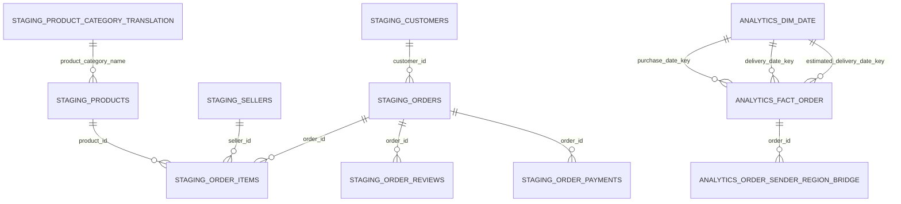

# Báo cáo dự án Phân tích sản lượng và hiệu quả giao hàng Olist

## Mục tiêu

Dự án dùng PostgreSQL và Apache Superset để phân tích sản lượng đơn hàng và hiệu quả giao hàng từ dữ liệu Olist Brazil. Đơn hàng Olist được dùng làm đại diện cho một bưu gửi để luyện SQL và BI theo góc nhìn nghiệp vụ bưu chính.

Seller và customer chỉ đại diện lần lượt cho điểm gửi và điểm nhận. `freight_value` là phí vận chuyển của Olist, không phải doanh thu hay lợi nhuận của Vietnam Post. Dữ liệu không có bưu cục, chặng trung chuyển, tuyến phát thực tế hay loại dịch vụ bưu chính; các thuộc tính đó không được tự tạo.

## Nguồn và kiến trúc dữ liệu

Nguồn là bộ `olistbr/brazilian-ecommerce` trên Kaggle, gồm customers, orders, order items, payments, reviews, sellers, products, product category translation và geolocation. CSV được nạp nguyên trạng vào schema `staging`. Lớp `analytics` cung cấp bảng fact và dimension phục vụ BI.



`analytics.fact_order` có hạt một dòng trên một đơn hàng. `order_items` và `order_reviews` luôn được tổng hợp theo `order_id` trước khi nối vào fact để tránh nhân số đơn, phí vận chuyển và review.

## Kiểm tra chất lượng dữ liệu

- Không có khóa không nối được giữa orders, customers, items, sellers, products, payments và reviews.
- Không có khóa trùng ở orders, customers, products, sellers, cặp order-item và cặp order-payment.
- Có 547 đơn có nhiều review, 1.278 đơn có nhiều seller và 510 đơn có nhiều bang gửi.
- Có 8 đơn trạng thái `delivered` nhưng thiếu thời điểm giao thực tế; các đơn này bị loại khỏi mẫu số tỷ lệ đúng hạn theo ngày dự kiến.
- Có 6 đơn không phải `delivered` nhưng lại có thời điểm giao; dữ liệu nguồn được giữ nguyên và điều kiện nghiệp vụ được áp dụng tại analytics.

Kết quả chi tiết xem tại `artifacts/quality_checks.txt` sau khi chạy pipeline local.

## Định nghĩa KPI

| KPI | Định nghĩa |
|---|---|
| Tổng số đơn | `COUNT(*)` trên `fact_order`, gồm mọi trạng thái |
| Đơn đã giao | Status `delivered` và có thời điểm giao thực tế |
| Tỷ lệ đúng hạn | Đơn giao không muộn hơn ngày dự kiến / đơn đã giao có đủ actual và estimate |
| Thời gian giao | Số ngày từ đặt đến giao, chỉ cho đơn giao hoàn chỉnh |
| Số ngày trễ | Số ngày giao vượt ngày dự kiến, chỉ cho mẫu đủ điều kiện tính đúng hạn |
| Phí vận chuyển | Tổng freight đã tổng hợp theo đơn |
| Điểm review | Trung bình review trong mỗi đơn trước khi phân tích ở cấp đơn |

Đơn hủy, chưa giao và đơn thiếu thời gian thực tế không nằm trong mẫu số tỷ lệ đúng hạn.

## Kết quả chính

| KPI | Giá trị |
|---|---:|
| Tổng số đơn | 99.441 |
| Đơn giao hoàn chỉnh | 96.470 |
| Đơn giao đúng hạn | 89.936 |
| Tỷ lệ đúng hạn | 93,23% |
| Đơn giao trễ | 6.534 |
| Thời gian giao trung bình | 12,56 ngày |
| Số ngày trễ trung bình của đơn trễ | 10,62 ngày |
| Tổng phí vận chuyển Olist | 2.251.909,54 |
| Điểm review trung bình | 4,09 / 5 |
| Tỷ lệ đánh giá thấp | 14,64% |

`staging.orders`, `analytics.fact_order` và `COUNT(DISTINCT order_id)` đều bằng 99.441. Tổng freight ở staging và fact đều bằng 2.251.909,54, xác nhận pipeline không double count.

## Dashboard Apache Superset

Dashboard có bốn page/tab và 27 chart:

1. **Tổng quan điều hành**: KPI chính, xu hướng sản lượng và tỷ lệ đúng hạn.
2. **Hiệu quả giao hàng**: trạng thái đơn, phân bố thời gian giao, nhóm ngày trễ và xu hướng thời gian giao.
3. **Mạng lưới gửi nhận**: sản lượng vùng/bang gửi và nhận, tuyến bang gửi chính đến bang nhận, so sánh nội bang và liên bang.
4. **Chất lượng dịch vụ**: review, tỷ lệ đánh giá thấp và quan hệ giữa review với tình trạng giao.

Bộ lọc dùng chung: thời gian đặt hàng, vùng nhận, bang nhận và vùng gửi chính.

Phát hiện đáng chú ý:

- Đơn liên bang có tỷ lệ trễ 8,05%; nội bang là 4,50%.
- Tuyến SP → SP có 31.404 đơn, lớn nhất về sản lượng.
- Tuyến SP → RJ có 8.422 đơn và tỷ lệ trễ 14,13%.
- Điểm review trung bình của đơn giao đúng hạn là 4,29; đơn giao trễ là 2,27.

Các số liệu thể hiện mối liên hệ quan sát từ dữ liệu, không phải kết luận nhân quả.

## Cấu trúc source và tái lập

- `sql/01_staging.sql`: schema/bảng staging.
- `sql/02_quality_checks.sql`: kiểm tra chất lượng.
- `sql/03_analytics.sql`: fact, dimension, view phân tích.
- `sql/04_kpi_validation.sql`: đối soát KPI chính.
- `sql/05_page_validation.sql`: đối soát KPI cho các page chuyên sâu.
- `scripts/run_pipeline.sh`: nạp lại và chạy pipeline end-to-end.
- `scripts/build_superset_dashboard.py`: tạo/cập nhật dashboard Superset.

Chạy lại pipeline:

```bash
bash scripts/run_pipeline.sh
.venv/bin/python scripts/build_superset_dashboard.py
```

Data source, runtime local, database local, password, cache Kaggle và artifact sinh ra được loại khỏi Git để không đưa dữ liệu nhạy cảm hoặc tệp lớn lên repository.

## Phân tích và đánh giá theo quy trình 5 bước

Phần này áp dụng khung: **Xác định vấn đề → Thu thập dữ liệu → Làm sạch dữ liệu → Phân tích dữ liệu → Diễn giải kết quả**. Mỗi bước phân biệt việc đã thực hiện, bằng chứng, hạn chế và đề xuất bổ sung.

Đánh giá dựa trên mã nguồn SQL và các kết quả đối soát đã lưu của project; không phải một lần chạy lại database hay kiểm tra lại dashboard trực tiếp. Các đề xuất dưới đây chưa được triển khai chỉ bằng việc bổ sung tài liệu này.

### 1. Xác định vấn đề — Problem Identification

**Bài toán:** Sản lượng đơn hàng phân bố như thế nào, tình trạng giao trễ tập trung ở đâu, và những khu vực nào cần được ưu tiên điều tra để cải thiện chất lượng giao hàng?

Người sử dụng kết quả được giả định là người phụ trách phân tích vận hành giao nhận. Mục tiêu là xác định nơi vừa có khối lượng lớn, vừa có chất lượng giao hàng chưa tốt để lựa chọn ưu tiên.

Các câu hỏi nghiên cứu:

1. Sản lượng đơn hàng biến động theo tháng và phân bố theo khu vực như thế nào?
2. Bao nhiêu đơn đã giao, bao nhiêu đơn giao đúng hạn hoặc trễ?
3. Thời gian từ đặt hàng đến giao hàng là bao lâu?
4. Bang nhận và cặp bang gửi–nhận nào tập trung nhiều đơn trễ?
5. Đơn giao trễ có điểm đánh giá khác với đơn giao đúng hạn không?

**Phạm vi:** Dữ liệu Olist Brazil, với ngày đặt hàng từ 04/09/2016 đến 17/10/2018. Đơn hàng là đại diện phục vụ bài tập bưu gửi; dữ liệu không phản ánh hoạt động Vietnam Post.

**Kết quả mong muốn:** Bộ KPI có định nghĩa rõ ràng, dashboard trả lời các câu hỏi trên và danh sách vấn đề đáng ưu tiên điều tra.

**Đánh giá:** Project đã có mục tiêu và KPI rõ, nhưng chưa có mục tiêu cải thiện được thống nhất, chẳng hạn mức đúng hạn mong muốn. Vì vậy, 93,23% là kết quả đo được; chưa đủ căn cứ để gọi là đạt hoặc không đạt yêu cầu nghiệp vụ. Ngày dự kiến là mốc tham chiếu của Olist, không được đồng nhất với cam kết SLA Vietnam Post.

### 2. Thu thập dữ liệu — Data Collection

Project dùng bộ `olistbr/brazilian-ecommerce` trên Kaggle, gồm 9 CSV. Các bảng trực tiếp phục vụ bài toán:

| Dữ liệu | Quy mô | Vai trò |
|---|---:|---|
| Orders | 99.441 đơn | Trạng thái, thời điểm đặt, giao và dự kiến |
| Order items | 112.650 dòng | Người bán, sản phẩm, phí vận chuyển |
| Customers | 99.441 dòng | Khu vực nhận |
| Sellers | 3.095 dòng | Khu vực gửi |
| Order reviews | 99.224 dòng | Điểm và nội dung đánh giá |

Ngoài ra có payments, products, geolocation và bảng dịch tên ngành hàng. Dữ liệu đã được tải bằng `kagglehub`, kiểm tra header và dòng mẫu trước khi xây schema, rồi nạp vào `staging`. Pipeline lưu số dòng và hash của file để hỗ trợ kiểm tra nguồn.

**Đánh giá:** Quy mô và trường dữ liệu đủ cho phân tích mô tả giao hàng ở cấp đơn, bang và tháng. Nhiều bản ghi không đồng nghĩa với đại diện cho toàn thị trường.

Các giới hạn:

- Không có dữ liệu bưu cục, nhân viên phát, lần phát, năng lực khai thác hoặc chặng trung chuyển.
- Không có chi phí vận hành để tính lợi nhuận hay năng suất lao động.
- Dữ liệu lịch sử Brazil phục vụ luyện phương pháp, không dùng để kết luận hiệu quả hiện tại của Vietnam Post.

Project đo được thời gian và mức đúng hạn, nhưng chưa đo đầy đủ hiệu quả vận hành theo nghĩa đầu ra trên chi phí hoặc nguồn lực.

### 3. Làm sạch dữ liệu — Data Cleaning

Project giữ dữ liệu nguồn tại `staging`, chuyển kiểu dữ liệu và áp dụng quy tắc phân tích tại `analytics`.

| Vấn đề | Kết quả | Cách xử lý hiện có |
|---|---:|---|
| Đơn có nhiều review | 547 đơn | Tổng hợp review về cấp đơn trước khi nối |
| Đơn có nhiều bang gửi | 510 đơn | Chọn bang gửi chính; có bảng phân bổ riêng |
| Status delivered nhưng thiếu thời gian giao | 8 đơn | Loại khỏi mẫu tính đúng hạn và thời gian giao |
| Đơn không có item | 775 đơn | Giữ đơn; khu vực gửi chưa xác định |
| Đơn không có review | 768 đơn | Giữ đơn; không tự gán điểm đánh giá |
| Bàn giao trước thời điểm đặt hàng | 166 dòng | Phát hiện trong kiểm tra chất lượng |
| Giao khách trước lúc bàn giao | 23 dòng | Phát hiện trong kiểm tra chất lượng |

**Điểm tốt:** Items và reviews được tổng hợp riêng theo đơn trước khi nối. Nếu một đơn có 3 item và 2 review, nối trực tiếp có thể tạo 6 dòng và làm tăng sai tổng phí vận chuyển. Pipeline hiện tại tránh được vấn đề này.

Kết quả đối soát đã lưu:

- Orders nguồn = fact = số `order_id` duy nhất = **99.441**.
- Phí vận chuyển nguồn = phí vận chuyển fact = **2.251.909,54**.

**Phần cần bổ sung:** Phát hiện bất thường chưa đồng nghĩa với xử lý hoàn chỉnh. Nên bổ sung cờ chất lượng thời gian trong bảng phân tích và quy tắc loại bản ghi riêng cho từng phép tính. Phân tích thời gian bàn giao→giao khách phải xử lý những bản ghi có thứ tự thời gian ngược.

Chưa thấy quy tắc đánh giá ngoại lai và kiểm tra độ nhạy của số trung bình trong phần triển khai đã kiểm tra. Một đơn giao rất lâu có thể là trường hợp thật cần điều tra, không nên tự động xóa.

### 4. Phân tích dữ liệu — Data Analysis

Project sử dụng thống kê mô tả và so sánh nhóm bằng SQL, sau đó trực quan hóa trên Superset. Phương pháp này phù hợp với bài toán; học máy không phải điều kiện bắt buộc để trả lời các câu hỏi hiện tại.

| Chỉ tiêu | Kết quả | Cách hiểu |
|---|---:|---|
| Tổng số đơn | 99.441 | Gồm mọi trạng thái |
| Đơn giao hoàn chỉnh | 96.470 | Delivered và có thời gian giao |
| Đơn đúng hạn | 89.936 | Không muộn hơn ngày dự kiến |
| Tỷ lệ đúng hạn | 93,23% | 89.936 / 96.470 đơn đủ điều kiện |
| Đơn trễ | 6.534 | Khoảng 6,77% mẫu đủ điều kiện |
| Thời gian đặt→giao trung bình | 12,56 ngày | Chỉ tính đơn giao hoàn chỉnh |
| Ngày trễ trung bình trong nhóm trễ | 10,62 ngày | Chỉ tính đơn giao trễ |

Ba so sánh đáng chú ý:

- **Liên bang:** 4.971 / 61.773 đơn đủ điều kiện giao trễ, tương ứng 8,05%. **Nội bang:** 1.563 / 34.697, tương ứng 4,50%. Khác biệt quan sát này chưa chứng minh nguyên nhân là khoảng cách hay trung chuyển.
- Cặp bang gửi chính **SP→RJ** có 8.422 đơn tổng, 1.152 đơn trễ và tỷ lệ trễ 14,13%. Mẫu số của tỷ lệ là các đơn đủ điều kiện, không phải toàn bộ 8.422 đơn.
- Điểm review trung bình ở nhóm đúng hạn là **4,29/5** trên 89.443 đơn có review; nhóm giao trễ là **2,27/5** trên 6.381 đơn có review. Điểm được tổng hợp theo đơn, rồi lấy trung bình trên các đơn có review.

**Phần nên bổ sung:**

- Median và P90 thời gian giao để mô tả trải nghiệm điển hình và nhóm giao chậm.
- Tách thời gian đặt→bàn giao và bàn giao→giao khách, sau khi kiểm tra chất lượng timestamp.
- So sánh theo tháng trong cùng khu vực, tránh kết luận từ các nhóm có cơ cấu khác nhau.
- Kiểm tra tháng đầu/cuối và mức hoàn tất đơn trước khi diễn giải xu hướng.
- Hiển thị số đơn đủ điều kiện cạnh tỷ lệ để tránh xếp hạng quá cao một nhóm có mẫu nhỏ.

**Giới hạn diễn giải:** 12,56 ngày là thời gian từ đặt hàng đến giao, bao gồm cả xử lý trước bàn giao; không thể coi toàn bộ là thời gian vận chuyển của đơn vị giao nhận. Kết quả của nhóm đã giao cũng không đại diện cho thời gian hoàn tất của các đơn chưa giao.

### 5. Diễn giải kết quả — Data Interpretation

Giá trị nghiệp vụ nằm ở việc chuyển số liệu thành ưu tiên điều tra. Ví dụ:

| Bang nhận | Tổng số đơn | Số đơn đủ điều kiện | Tỷ lệ trễ | Số đơn trễ |
|---|---:|---:|---:|---:|
| SP | 41.746 | 40.494 | 4,49% | 1.820 |
| RJ | 12.852 | 12.350 | 12,11% | 1.495 |

**RJ** đáng điều tra vì tỷ lệ trễ cao và số đơn trễ lớn. **SP** vẫn cần chú ý vì số đơn trễ tuyệt đối lớn hơn RJ dù tỷ lệ thấp hơn. Do đó, ưu tiên nghiệp vụ phải xem cả tỷ lệ lẫn quy mô tác động.

Cặp **SP→RJ** là một đối tượng cụ thể để phân tích tiếp: giao chậm tập trung ở tháng nào, seller nào, hoặc khoảng thời gian trước hay sau bàn giao? Đây là cặp địa lý suy ra từ seller/customer, không phải tuyến khai thác thực tế.

Chênh lệch review cho thấy giao trễ đi kèm trải nghiệm khách hàng kém hơn. Chưa thể kết luận toàn bộ chênh lệch do giao trễ gây ra, vì review còn phản ánh sản phẩm, người bán và các yếu tố khác.

**Kiến nghị dựa trên bằng chứng hiện có:**

1. Ưu tiên điều tra RJ và cặp SP→RJ.
2. Theo dõi song song tỷ lệ trễ, số đơn trễ và mức độ trễ.
3. Phân tích các khoảng thời gian để khoanh vùng nơi phát sinh chậm.
4. Khi áp dụng vào Vietnam Post, bổ sung mã bưu gửi, dịch vụ, cam kết thời gian, sự kiện khai thác, lần phát và nguồn lực vận hành.

**Câu hỏi nghiên cứu tiếp theo:** Tỷ lệ trễ cao ở SP→RJ tập trung ở giai đoạn nào của vòng đời đơn hàng, và khác biệt đó còn tồn tại khi so sánh cùng tháng, cùng nhóm seller hay không?

Câu hỏi này đưa project quay lại bước xác định vấn đề. Chưa có căn cứ để đề xuất tăng nhân sự, đổi tuyến hoặc khẳng định một mức cải thiện cụ thể chỉ từ dữ liệu hiện tại.

### Đánh giá tổng thể và bằng chứng

Project có nền tảng dữ liệu tốt và trả lời được **đã xảy ra điều gì, ở đâu**. Để mạnh hơn về phân tích nghiệp vụ, cần bổ sung bằng chứng cho **vì sao**, tiêu chí chọn ưu tiên và cách đo kết quả sau hành động. Có đủ 4 page dashboard là phần trình bày; mức độ hoàn chỉnh của nghiên cứu phụ thuộc vào khả năng trả lời các câu hỏi đó.

Nguồn đối chiếu trong repository:

- [README: cấu trúc dữ liệu, định nghĩa và kết quả](../README.md).
- [Kiểm tra chất lượng dữ liệu](../sql/02_quality_checks.sql).
- [Mô hình và phép biến đổi analytics](../sql/03_analytics.sql).
- [Đối soát KPI chính](../sql/04_kpi_validation.sql).
- [Đối soát các page chuyên sâu](../sql/05_page_validation.sql).

Kết quả SQL được đọc khi đánh giá nằm trong các artifact local `quality_checks.txt`, `kpi_validation.txt`, `page_validation.txt` và `additional_profile.txt`; chúng không được đính kèm repository trong lần bổ sung tài liệu này. Các chỉ tiêu dùng trong đánh giá được trình bày trực tiếp ở trên và có thể kiểm tra lại bằng pipeline của project.
