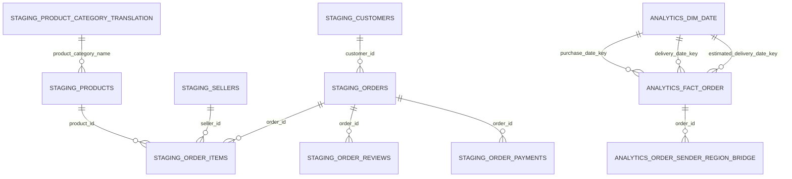

# Báo cáo dự án Phân tích sản lượng và hiệu quả giao hàng Olist

## Mục tiêu

Dự án dùng PostgreSQL và Apache Superset để phân tích sản lượng đơn hàng và hiệu quả giao hàng từ dữ liệu Olist Brazil. Đơn hàng Olist được dùng làm đại diện cho một bưu gửi để luyện SQL và BI theo góc nhìn nghiệp vụ bưu chính.

Seller và customer chỉ đại diện lần lượt cho điểm gửi và điểm nhận. `freight_value` là phí vận chuyển của Olist, không phải doanh thu hay lợi nhuận của Vietnam Post. Dữ liệu không có bưu cục, chặng trung chuyển, tuyến phát thực tế hay loại dịch vụ bưu chính; các thuộc tính đó không được tự tạo.

## Nguồn và kiến trúc dữ liệu

Nguồn là bộ `olistbr/brazilian-ecommerce` trên Kaggle, gồm customers, orders, order items, payments, reviews, sellers, products, product category translation và geolocation. CSV được nạp nguyên trạng vào schema `staging`. Lớp `analytics` cung cấp bảng fact và dimension phục vụ BI.



`analytics.fact_order` có hạt một dòng trên một đơn hàng. `order_items` và `order_reviews` luôn được tổng hợp theo `order_id` trước khi nối vào fact để tránh nhân số đơn, phí vận chuyển và review.

## Kiểm tra chất lượng dữ liệu

- Không có khóa không nối được giữa orders, customers, items, sellers, products, payments và reviews.
- Không có khóa trùng ở orders, customers, products, sellers, cặp order-item và cặp order-payment.
- Có 547 đơn có nhiều review, 1.278 đơn có nhiều seller và 510 đơn có nhiều bang gửi.
- Có 8 đơn trạng thái `delivered` nhưng thiếu thời điểm giao thực tế; các đơn này bị loại khỏi mẫu số SLA.
- Có 6 đơn không phải `delivered` nhưng lại có thời điểm giao; dữ liệu nguồn được giữ nguyên và điều kiện nghiệp vụ được áp dụng tại analytics.

Kết quả chi tiết xem tại `artifacts/quality_checks.txt` sau khi chạy pipeline local.

## Định nghĩa KPI

| KPI | Định nghĩa |
|---|---|
| Tổng số đơn | `COUNT(*)` trên `fact_order`, gồm mọi trạng thái |
| Đơn đã giao | Status `delivered` và có thời điểm giao thực tế |
| Tỷ lệ đúng hạn | Đơn giao không muộn hơn ngày dự kiến / đơn đã giao có đủ actual và estimate |
| Thời gian giao | Số ngày từ đặt đến giao, chỉ cho đơn giao hoàn chỉnh |
| Số ngày trễ | Số ngày giao vượt ngày dự kiến, chỉ cho mẫu SLA đủ điều kiện |
| Phí vận chuyển | Tổng freight đã tổng hợp theo đơn |
| Điểm review | Trung bình review trong mỗi đơn trước khi phân tích ở cấp đơn |

Đơn hủy, chưa giao và đơn thiếu thời gian thực tế không nằm trong mẫu số tỷ lệ đúng hạn.

## Kết quả chính

| KPI | Giá trị |
|---|---:|
| Tổng số đơn | 99.441 |
| Đơn giao hoàn chỉnh | 96.470 |
| Đơn giao đúng hạn | 89.936 |
| Tỷ lệ đúng hạn | 93,23% |
| Đơn giao trễ | 6.534 |
| Thời gian giao trung bình | 12,56 ngày |
| Số ngày trễ trung bình của đơn trễ | 10,62 ngày |
| Tổng phí vận chuyển Olist | 2.251.909,54 |
| Điểm review trung bình | 4,09 / 5 |
| Tỷ lệ đánh giá thấp | 14,64% |

`staging.orders`, `analytics.fact_order` và `COUNT(DISTINCT order_id)` đều bằng 99.441. Tổng freight ở staging và fact đều bằng 2.251.909,54, xác nhận pipeline không double count.

## Dashboard Apache Superset

Dashboard có bốn page/tab và 27 chart:

1. **Tổng quan điều hành**: KPI chính, xu hướng sản lượng và tỷ lệ đúng hạn.
2. **Hiệu quả giao hàng**: trạng thái đơn, phân bố thời gian giao, nhóm ngày trễ và xu hướng thời gian giao.
3. **Mạng lưới gửi nhận**: sản lượng vùng/bang gửi và nhận, tuyến bang gửi chính đến bang nhận, so sánh nội bang và liên bang.
4. **Chất lượng dịch vụ**: review, tỷ lệ đánh giá thấp và quan hệ giữa review với tình trạng giao.

Bộ lọc dùng chung: thời gian đặt hàng, vùng nhận, bang nhận và vùng gửi chính.

Phát hiện đáng chú ý:

- Đơn liên bang có tỷ lệ trễ 8,05%; nội bang là 4,50%.
- Tuyến SP → SP có 31.404 đơn, lớn nhất về sản lượng.
- Tuyến SP → RJ có 8.422 đơn và tỷ lệ trễ 14,13%.
- Điểm review trung bình của đơn giao đúng hạn là 4,29; đơn giao trễ là 2,27.

Các số liệu thể hiện mối liên hệ quan sát từ dữ liệu, không phải kết luận nhân quả.

## Cấu trúc source và tái lập

- `sql/01_staging.sql`: schema/bảng staging.
- `sql/02_quality_checks.sql`: kiểm tra chất lượng.
- `sql/03_analytics.sql`: fact, dimension, view phân tích.
- `sql/04_kpi_validation.sql`: đối soát KPI chính.
- `sql/05_page_validation.sql`: đối soát KPI cho các page chuyên sâu.
- `scripts/run_pipeline.sh`: nạp lại và chạy pipeline end-to-end.
- `scripts/build_superset_dashboard.py`: tạo/cập nhật dashboard Superset.

Chạy lại pipeline:

```bash
bash scripts/run_pipeline.sh
.venv/bin/python scripts/build_superset_dashboard.py
```

Data source, runtime local, database local, password, cache Kaggle và artifact sinh ra được loại khỏi Git để không đưa dữ liệu nhạy cảm hoặc tệp lớn lên repository.
